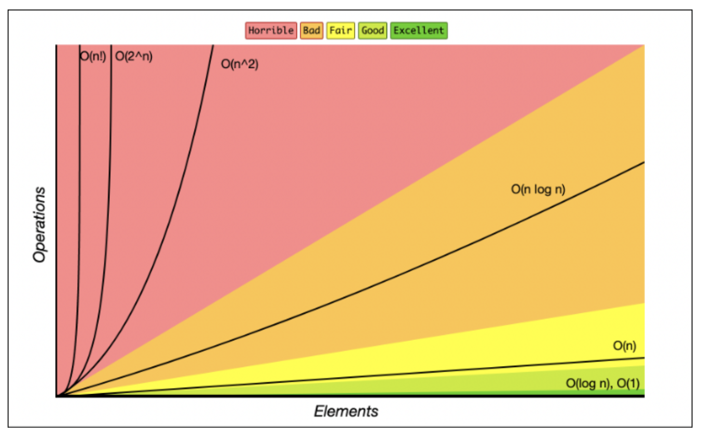
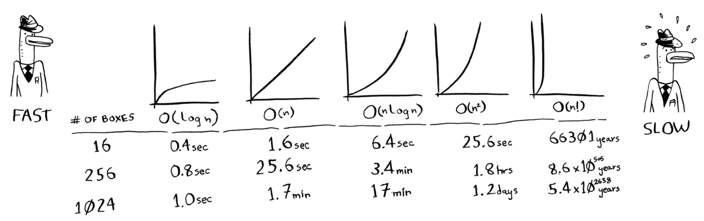
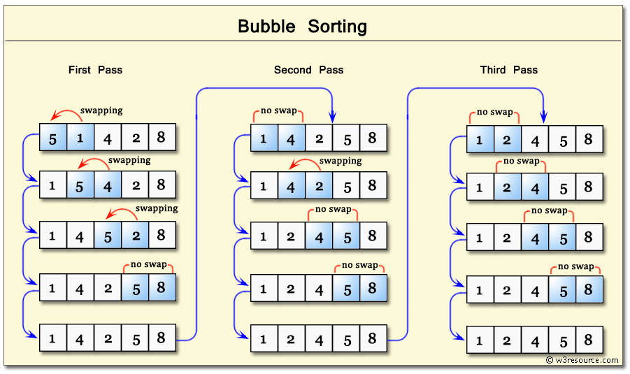
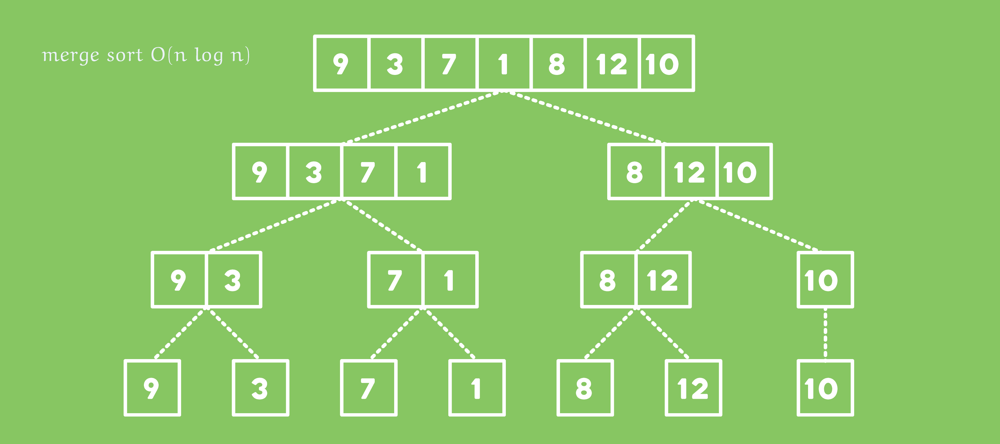
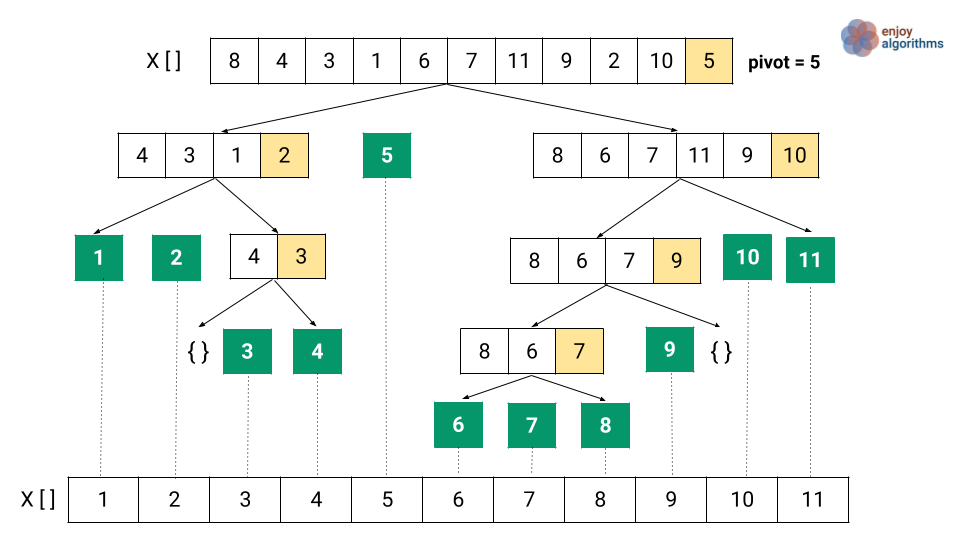
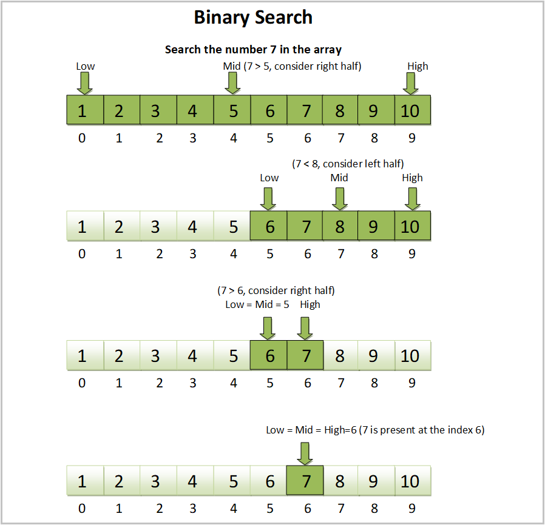
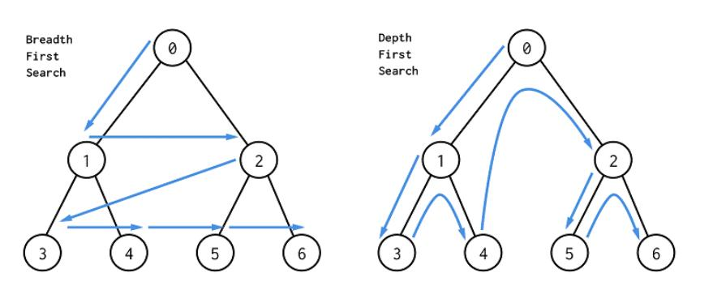
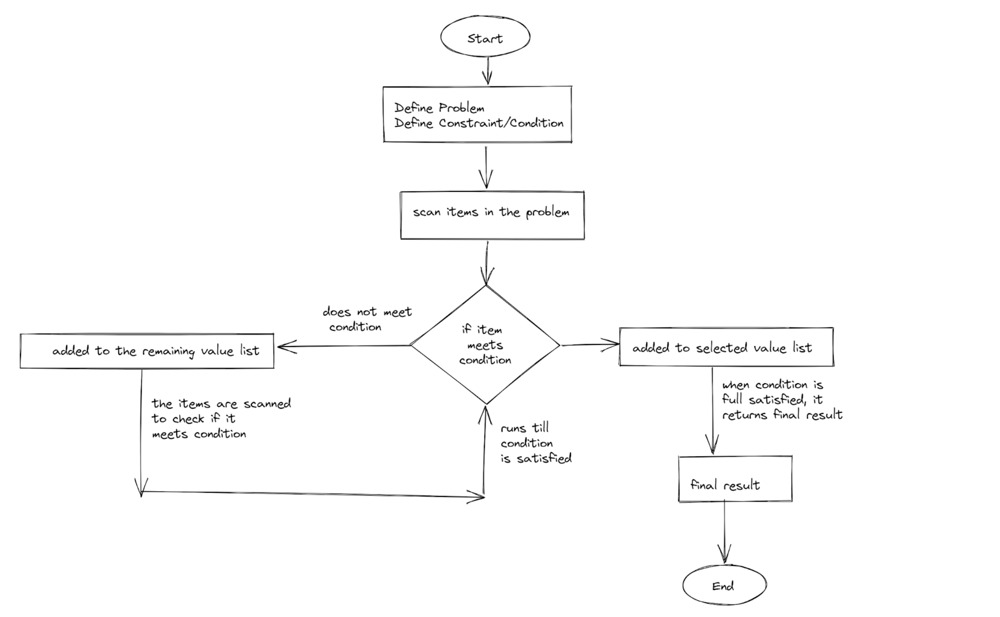

# Algorithms
## Problem Solving

------

### Seven Steps

1. Listen for clues, you'll hear big details from interviewer
2. Confirm your understanding, provide i/o examples
3. Describe your approach - data structure type, algorithm type
4. Walk through algo, before you code
5. Write your code
6. Verification
7. Optimization

### Tips & Tricks

- Don't just dive in. Make sure you know the little details (i.e algo details, data structures, indices, etc).

- Use the built in features of your programming language! Ask for permission though.

- Think about error cases, boundary checks, etc.

### Verification

- Don't just dive in
- Check for hot spots, high risk lines:
    - Math
    - Moving indices
    - Parameters when calling recursion
    - Bases cases
- Test cases:
    - Small test cases first
    - Edge cases


## Big O Notation

---

### What is it Big O

It's about how your algo scales. N = number of inputs, function output = total number of operations required. 

In other words it provides a way to analyze the efficiency of algorithms as the input size grows. Big O specifically describes the worst-case scenario, and can be used to describe the execution time required or the space used (e.g. in memory or on disk) by an algorithm.

### Rules & Tips

- Include all functions/operations
- Define the variables you need
- Adding vs multiplying
- We drop constants
- Remember the call stack  
- Drop non-dominant terms:
    - O(n + n^2) = O(n^2)
    - O(n^5 + n^2) = O(n^5)
    - O(2^n + n^2) = O(2^n)
    - O(k + n^2) = O(k + n^2)

### O(1) Constant Time

An algorithm that will always **execute in the same time** (or space) regardless of the size of the input data set.

```python
def returns_null(lst):
  	return null
```

### O(n) Linear Time

Operations grow with the input in a 1:1 ratio. A typical example is **iteration**.

```java
bool iterateThenReturn(IList<string> elements, string value) {
    foreach (var element in elements) {
        if (element == value) return true;
    }
    return false;
}
```

### O(n k) Linear Time V2

There is single loop iteration and then a nested loop that is limited to the range of the underlying iteration element.

### O(n^2) Quadratic Time 

Operations are directly proportional to the square of the size of the input data set. This is common with algos that involve nested iterations over the data set. The power number is proportional to the number of nested iterations, so this can eventually become Cubic complexity too. This includes some less efficient ordering algorithms such as: bubble sort, selection sort, and insertion sort.

```java
bool ContainsDuplicates(IList<string> elements) {
    for (var outer = 0; outer < elements.Count; outer++) {
        for (var inner = 0; inner < elements.Count; inner++) {
            if (outer == inner) continue;
            if (elements[outer] == elements[inner]) return true;
        }
    }
    return false;
}
```

### O(2^n) Exponential Time 

Operations growth doubles with each addition to the input data set. The operations growth is exponential, starting off shallow and then rising significantly. A typical example of this is the recursive calculations of Fibonacci numbers. 

```java
int Fibonacci(int number) {
    if (number <= 1) return number;
    return Fibonacci(number - 2) + Fibonacci(number - 1);
}
```

### O(log n) Logarithmic Time 

**Logarithms** - logs are the flip of exponentials. How many 10s do we multiply together to get 100? The answer is 2: 10 × 10. So log base 10 100 = 2

The number of operations grows at a slower rate than the input. However, it requires many operations during initial processing followed by continously less as the input grows, following the same shape of logarithmic graph equation. This makes the algorithm less efficient with small inputs but very efficient with larger ones. A typical example is a **binary search**. 

### O(n log n) Linearithmic Complexity 

Complexity is a mix between logarithmic and linear complexity. It is typical of some smart algorithms used to order data, such as Mergesort, Heapsort, and Quicksort. 






## Recursion

------

### Complexity

Time Complexity - at least O(n) but could get into O(2^n)

Space Complexity - recursions takes up a lot of memory

### **Base & Recursive Case**

When you write a recursive function, you have to tell it when to stop recursing. That’s why *every recursive function has two parts: the base case, and the recursive case.* The base case is when the function doesn’t call itself again... so it doesn’t go into an infinite loop. The recursive case is when the function calls itself. 

### The Call Stack

Your computer uses a stack internally called the call stack. This is important when doing recursion.

```python
def countdown(i):
  	print(i)
		if i <= 0: 		# Base case 
    		return
		else: 				# Recursive case 
    		countdown(i-1)
```

### Applications

- Choices. Do I go left or right? Which should I try first?
- Superlatives. Biggest, longest, shortest?
- Divide and conquer. Can you solve for parts separately?
- Fibonacci


## Sorting

------

### Typical Applications

- Getting Nth biggest or smallest
- Order ascending or descending


### Bubble Sort

#### Complexity

Time: O(n^2)

#### Explanation

Walk through array, comparing pairs. If out of order, swap. Repeat until array is sorted.




### Merge Sort 

#### Complexity 

Time: O(n log n)

#### Explanation

This applys the divide and conquer approach. The sort begins by breaking the dataset into individual pieces and sorting the pieces. It then merges the pieces in a manner that ensures that it has sorted the merged piece. The sorting and merging continues until the entire dataset is again a single piece. 

Keep halving an array until it consists of only one element, then take the smallest element between two adjacent subarrays and repeat until all the elements are taken, resulting in a sorted subarray, the process is repeated until all elements are sorted.




### Quick Sort 

#### Complexity 

Average-case time complexity of O(n log n)

Worst-case time complexity of O(n^2)

#### Explanation

Divide and conquer approach, it finds the element called the Pivot which divides the array into two halves in such a way that elements in the left half are smaller than pivot and elements in the right are greater than the pivot.

The pivot is usually the last element of the list

We then recursively perform three steps:

- Bring the pivot to the middle index
- Quick sort the left part
- Quick sort the right part




## Searching

------

### Binary Search 

#### Complexity 

Time: O(log n)

Space: O(1)

#### Explanation

Its input is a sorted list of elements, this is required otherwise won't work. With binary search, you guess the middle number and eliminate half the remaining numbers every time. It takes two inputs, the sorted array and an item to search. If the item is in the array it returns the position (index), otherwise returns null.

- First you get the low and high index
- For each iteration, you'll take the middle position between the low and high, this is called the guess
- If the guess is correct your return, otherwise:
    - If guess is larger than target item, you make the high = mid - 1, this is to exclude the already processed high point
    - If guess is smaller than target item, you make the low = mid + 1, this is to exclude the already processed high point



#### Application

- Sorted data as input.
- Guesses can be over / under estimated.


### Depth First Search 

#### Complexity 

Time: O(V + E), where V = vertices and E = edges

Space: O(H), where H = maximum height

#### **Explanation**

Can be applied to directed and undirected graphs.

Depth refers to vertical before horizontal. Search each node in graph as deep as you can before visiting its neighbors.

Use a hash map to mark visited nodes. Challenges - you might go really deep, when there is actually a really obvious one.


#### **Application**

- Relationships between items


### Breadth First Search 

#### Complexity 

Time: O(V + E), where V = vertices and E = edges

Space: O(V)

#### **Explanation**

Can be applied to directed and undirected graphs.

Breadth means broad or wide, meaning the algo will progress horizontally (same level) before we proceed vertically. 

It finds the shortest distance between two things, if there is one. And leverages a queue to keep track of nodes.



#### **Application**

- Relationships between items
- Fewest moves to an element


### Dijkstra Algorithm

#### **Explanation**

Applied for shortest path in weighted graphs. It has four steps:

1. Find the cheapest node. This is the node you can get to in the least amount of time.
2. Check whether there’s a cheaper path to the neighbors of this node. If so, update their costs.
3. Repeat until you’ve done this for every node in the graph.
4. Calculate the final path. 

Breadth means broad or wide, meaning the algo will progress horizontally (same level) before we proceed vertically. 

Dijkstra’s algorithm works when all the weights are positive. If you have negative weights, use the Bellman-Ford algorithm.

#### **Application**

- Shortest path between nodes for a weighted graph.


## Greedy Algorithms

------

### NP Complete Problems

NP-complete problems have no known fast solution. If you have an NP-complete problem, your best bet is to use an approximation algorithm. Greedy algorithms are easy to write and fast to run, so they make good approximation algorithms.

### **Explanation**

A greedy algorithm is simple: at each step, pick the locally optimal solution, and in the end you’re left with the globally optimal solution.

We make a decision based on what we know right now, and don't care about what happens down the road.

The algorithm is fast and efficient with time complexity of O(n log n) or O(n). Therefore applied in solving large-scale problems.

The search for optimal solution is done without repetition – the algorithm runs once.

Best seen in contrast to dynamic programming.




## Dynamic Programming

------

### **Explanation**

Dynamic programming is useful when you’re trying to optimize something given a constraint.

You can use dynamic programming when the problem can be broken into discrete subproblems, and they don’t depend on each other.

Some general tips follow:

- Every dynamic-programming solution involves a grid.
- The values in the cells are usually what you’re trying to optimize. 
- Each cell is a subproblem, so think about how you can divide your problem into subproblems. 

Memoization is the process of storing sub-problem results in a top-down approach. So we use hash tables (dictionaries) in DP.


## Other Algos

------

### Top K Elements

- Use sorting algorithm


### Sliding Window

Tbd


### Combination Sum Backtracking

Tbd


### Inverting a Binary Tree 

Tbd
