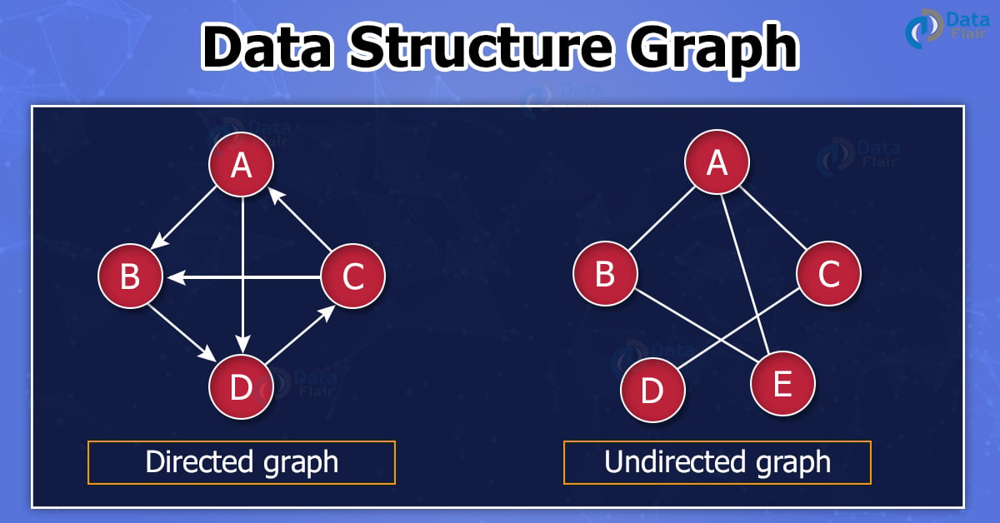
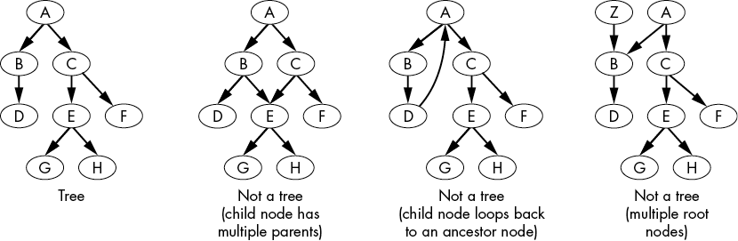
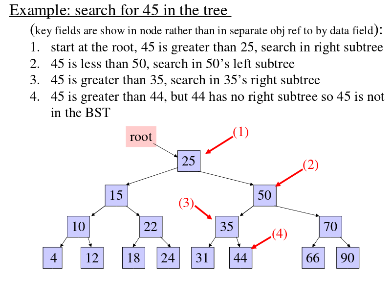
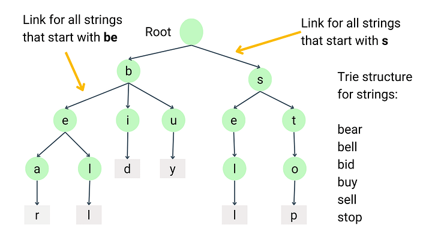
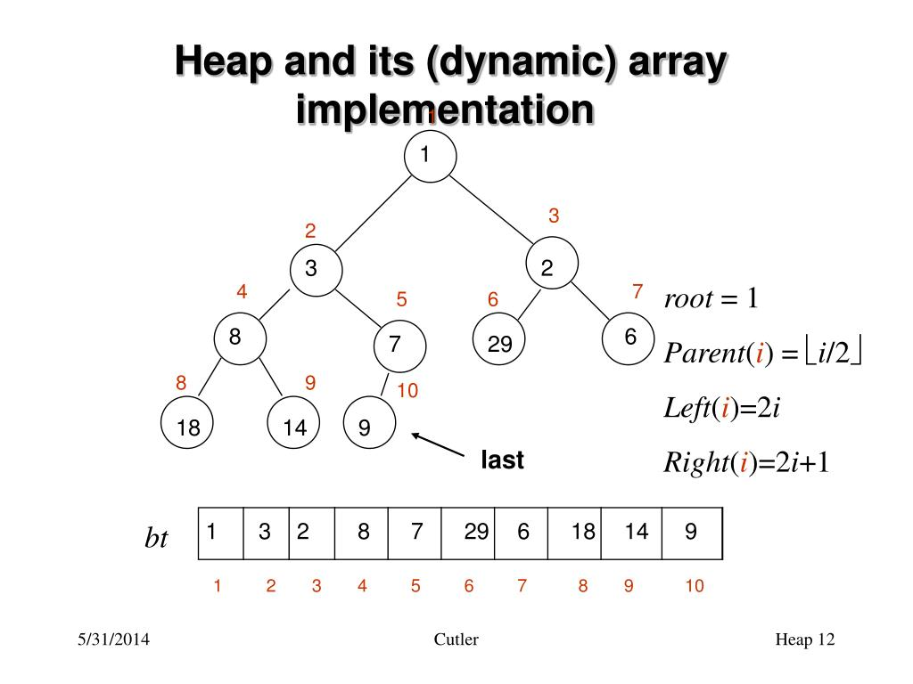

# Data Structures

## Linear Structures

---

### Arrays

#### Complexity

- Access: `O(1)`
- Search: `O(n)`
- Insert:
    - At the end: `O(1)`
    - Anywhere else: `O(n)`
- Delete:
    - At the end: `O(1)`
    - Anywhere else: `O(n)`


#### Explanation

- Most fundamental building block of data structures.
- Inserts and deletes are quick at ends, but slow anywhere else since you have to shift all the elements down.
- You can create matrices too `matrix[col][row]`.

#### Application

- 2D arrays: creation, indexing, etc
- Sorting
- Get min & max
- Partioning, merging, slicing
- List comprehension, lambda, reduce, map, filter, etc


### Linked Lists

#### Complexity

- Access: `O(n)`
- Search: `O(n)`
- Insert: `O(1)`
- Delete: `O(1)`


#### Explanation

- A linked list is like a chain of nodes, where each unit referred to as a node (data + pointer) contains information like data and a pointer to the next node in the chain.
- There’s a head pointer, which points to the first element of the linked list. If the list is empty then it simply points to null or nothing.
- Quick inserts, it’s as easy as changing what the previous element points to.
- You don’t need to know the size in advance. The more elements you add, the bigger the chain gets.
- Used to implement file systems, stacks, queues, hash tables, graphs and trees.
- Types of linked lists:
   - Singly Linked List (Unidirectional): Here each node in the list stores the contents of the node and a pointer to the next node in the list. It does not store any pointer to the previous node.
   - Doubly Linked List (Bi-directional): These contain a pointer to the previous node and the next node.
   

```python
class ListNode:
    def __init__(self, val, next=None):
        self.val = val
        self.next = next
```


#### Array vs Linked List

- Size of arrays is fixed, Linked Lists are dynamic.
- Inserting and deleting a new element in an array is expensive. Whereas both insertion and deletion can easily be done in Linked Lists (no movements of nodes required).
- Reading is faster with Araray. Random access is not allowed in linked lists, you need to go through all the nodes that come before the node you need.
- Array uses less memory. Extra memory space for a pointer is required with each element of the linked list.
  


### Stacks

#### Complexity

- Access: `O(n)`
- Search: `O(n)`
- Insert: `O(1)`
- Delete: `O(1)`


#### Explanation

- Think of a stack of plates! Stacks are a linear data structure which the order LIFO are used for accessing elements.
- Operations include:
    - Push (inserts element at the top)
    - Pop (returns the top element, after removing it from the stack)
    - Peek (returns value of the first item without removing the element)
    - isEmpty (returns true if empty)
    

```python
class Stack:
    def __init__(self):
        self.items = []

    def is_empty(self):
        return len(self.items) == 0

    def push(self, item):
        self.items.append(item)

    def pop(self):
        if not self.is_empty():
            return self.items.pop()

    def peek(self):
        if not self.is_empty():
            return self.items[-1]

    def size(self):
        return len(self.items)
```


#### Application

- Used to reverse our work. Check if strings are balanced (right left comparison).
- Reverse an array: you push a given word to stack, letter-by-letter, then pop letters from the stack into an array or list.
- Undo Mechanism in Text Editors: keeping all text changes in a stack.
- Backtracking: at each point you store choices, then backtracking means popping a previous choice from the stack.


### Queues

#### Complexity

- Access: `O(n)`
- Search: `O(n)`
- Insert: `O(1)`
- Delete: `O(1)`


#### Explanation

- Think of a cafeteria line!
- Queue is a linear structure which follows the order FIFO to access elements.
- Operations include:
    - En-Queue (insert item into the back of the queue)
    - De-Queue (remove item from the front of the queue)
    - Front (returns first element)
    - Rear (returns last element)
    - isEmpty (returns true if empty)
    

```python
class Queue:
    def __init__(self):
        self.items = []

    def enqueue(self, item):
        self.items.append(item)

    def dequeue(self):
        if not self.is_empty():
            return self.items.pop(0)

    def front(self):
        if not self.is_empty():
            return self.items[0]
      
    def is_empty(self):
        return len(self.items) == 0
```

#### Application

- Process items in the order they appear.
- Print Queues
- Call center phone systems
- In a multitasking operating system, the CPU cannot run all jobs at once, so jobs must be scheduled or queued.
- Breadth first search in a graph; an algorithm for traversing or searching graph data structures. It starts at some arbitrary node of the graph and explores the neighbor nodes first, before moving to the next level neighbors.


## Non-Linear Structures

---

### Hash Maps

#### Complexity

- Search: `O(1)`
- Insert: `O(1)`
- Delete: `O(1)`


#### Explanation

Also known as dictionary in Python.

First understand a hash function, which is where you input a string and get back a number (hash). Combining hash function with arrays gives you a hash map (or also called hash table).

Hash tables have really fast search, insert, and delete.

Collisions are bad. You need a hash function that minimizes collisions.

#### Application

- Use hash maps for caching.
- Lookups by key
- Counting how many times, great for catching duplicates


### Graphs

#### Complexity

- Adjacency Matrix:
    - Search: `O(1)`
    - Insert: `O(1)`
    - Delete: `O(1)`
- Adjacency List:
    - Search: `O(V)`
    - Insert: `O(1)`
    - Delete: `O(V)`


#### Explanation

Graphs are made up of nodes and edges. A node can be directly connected to many other nodes. Those nodes are called its *neighbors*. Graphs are a way to model how different things are connected to one another.

The *nodes* contain data, while the *edges* represent a relationship with another node. Nodes are also called *vertices*.

There are two types of graphs: 

- Directed - the relationship is only one way
- Undirected - the relationship is both ways

```python
adjacency_matrix = [
    [0, 1, 0], 
    [1, 0, 1],  
    [0, 1, 0]  
]

adjacency_list = {
    0: [1],      
    1: [0, 2],   
    2: [1]       
}
```




#### Application

- Relationships and routes


### Trees

#### Complexity

- Access: `O(log(n))`
- Search: `O(log(n))`
- Insert: `O(log(n))`
- Delete: `O(log(n))`


#### Explanation

A tree is a special kind of graph. The starting node of a tree is called the *root*, and the nodes at the end are called *leaves*. Trees always have exactly one root. 

A tree is considered a specific kind of data structure called a *directed acyclic graph* *(DAG)*. The graph is *acyclic* because there are no loops, or *cycles*, from child nodes to their own ancestor nodes; the “branches” of the tree must keep growing in the same direction.

*Parent nodes* at the top have edges to zero or more *child nodes* beneath them. Therefore, leaves are the nodes that do not have children, parent nodes are the non-leaf nodes, and child nodes are all the non-root nodes. Nodes in a tree can have edges to multiple child nodes. The parent nodes that connect a child node to the root node are also called the child node’s *ancestors*. The child nodes between a parent node and a leaf node are called the parent node’s *descendants*. Parent nodes in a tree can have multiple child nodes. But every child node has exactly one parent, except for the root node, which has zero parents. In trees, only one path can exist between any two nodes.



#### Traversals

Trees have three kinds of tree traversal algorithms: preorder, postorder, and inorder.

**Pre and Post Order Traversal** algorithms access a node’s data before or after traversing its child nodes. This concept is leveraged in depth first search. 

**Inorder Tree Traversal** traverses the left child node, then accesses the node’s data, and then traverses the right child node. This concept is leveraged in binary search trees.


#### Application

- Hierarchal data
- Perfect candidate to use recursion


### Binary Search Tree

#### Complexity

- Access: `O(log(n))`
- Search: `O(log(n))`
- Insert: `O(log(n))`
- Delete: `O(log(n))`


#### Explanation

A Binary Tree, where each node has 0 to 2 children, thus being binary (either no children or 2 children). 

A Binary Search Tree is where, for each node, all children on the left are lesser and on the right are greater.

Thus this makes BST an easily understood balanced approach to storing the keys. BST tends to work best in situations in which you spend more time searching and less time building the tree. 

```python
class Node:
    def __init__(self, key, left=None, right=None):
        self.left = left
        self.right = right
        self.val = key
```




#### Application

- Hierarchal data
- Perfect candidate to use recursion


### Tries

#### Complexity

- Search: `O(n)`
- Insert: `O(n)`
- Delete: `O(n)`


#### Explanation

An ordered tree data structure that is used to store a dynamic set or associative array where the keys are usually strings. Unlike a binary search tree, no node in the tree stores the key associated with that node; instead, its position in the tree defines the key with which it is associated.



```python
class TrieNode:
    def __init__(self, char: str):
        self.char = char
        self.is_end = False
        self.counter = 0
        self.children = {}
```

#### Application

- Prefix matching
- Text search
- Is valid word
- Spell check
- Autocomplete suggestions


### Heaps

#### Complexity

- Access Max/Min: `O(1)`
- Insert: `O(log(n))`
- Delete Max / Min: `O(log(n))`


#### Explanation

A special type of binary tree. There are two types max and min heap.

It is a great system for being able to continously extract the minimum or maximum value. 

Implement as an array approach, which is more efficient and takes up less memory.

```python
max_heap = [16, 14, 10, 8, 7, 9, 3, 2, 4, 1]
						1   2   3   4  5  6  7  8  9  10 
```




#### Application

- Whenever you need quick access to max or min.

    
